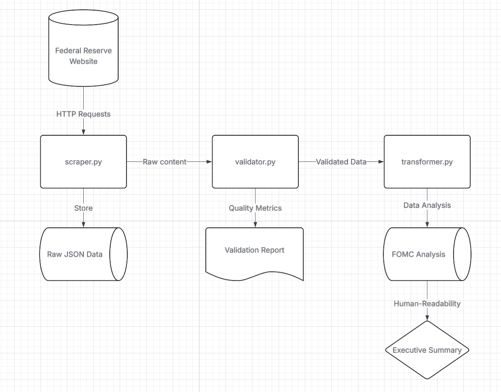

Executive Summary:

The Problem:

Financial markets move billions of dollars based on Federal Reserve policy decisions, but the critical insights are buried in lengthy meeting minutes released weeks after each Federal Open Market Committee (FOMC) meeting. Investment firms, traders, and analysts spend hours manually reading these documents to extract:

- Policy direction signals (will rates go up or down?)
- Economic sentiment (how optimistic/pessimistic is the Fed?)
- Market implications (what should traders do?)
- Consensus strength (how unified are Fed officials?)

Our Solution:

This automated intelligence system transforms raw Federal Reserve meeting minutes into actionable market insights within minutes, not hours. The system:

- Automatically scrapes the latest FOMC minutes from the Federal Reserve website
- Validates data quality to ensure reliable analysis
- Extracts market signals using advanced text analysis
- Generates trading recommendations based on Fed sentiment
- Produces executive summaries ready for immediate use

Business Value:

- Time Savings: Reduces analysis time from hours to minutes
- Competitive Advantage: Faster insights mean better trading decisions
- Risk Reduction: Consistent, systematic analysis reduces human error
- Scalability: Processes historical data and new releases automatically

Key Features:

- Respectful Data Collection: Built-in delays respect Fed servers
- Quality Assurance: Multi-layer validation ensures data reliability
- Market Intelligence: Generates hawkish/dovish sentiment scores
- Business Ready: Produces both technical data and executive summaries

Flowchart:

Setup and Deployment Instructions:

Prerequisites:

- Python 3.8 or higher
- Internet connection
- 2GB available disk space (for data storage)

1. Download and Install

Using bash:
# Clone or download the project
git clone <repository-url>
cd FED-MINUTES-SCRAPER

# Install required packages
pip install -r requirements.txt

2. Run the System
# Navigate to source directory
cd src/

# Run the complete pipeline
python scraper.py

3. View Results
Results are automatically saved to the data/ folder:

raw_fomc_data_[timestamp].json - Complete scraped data
fomc_analysis_[timestamp].json - Market intelligence
executive_summary_[timestamp].txt - Business-ready summary